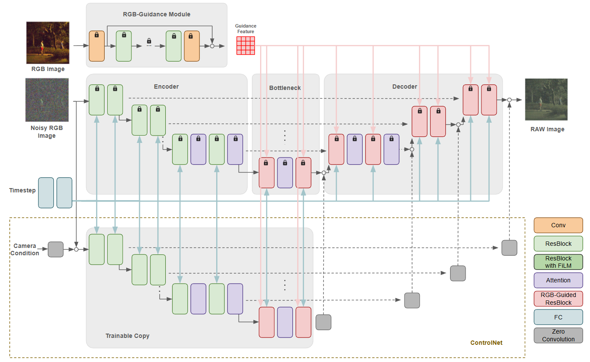

# ERD: Extended RAW-Diffusion Framework for De-rendering sRGB Images

## Overview



> **Abstract**: Recovering RAW sensor measurements from sRGB images is a central problem in computational photography, as RAW data preserves the true scene radiance prior to the nonlinear transformations introduced by a camera’s Image Signal Processing (ISP) pipeline. However, ISPs vary across different camera brands and models, making inverse ISP reconstruction particularly challenging when the sensor characteristics are unknown. Existing approaches often rely on metadata, modifiable ISP, or camera-specific training, which limits their ability to generalize across unseen devices. In this project, we investigate a diffusion-based inverse ISP framework designed for cross-sensor RAW reconstruction. Building upon the RAW-Diffusion model, we incorporate a ControlNet-guided architecture that provides structured conditioning to improve generalization without requiring metadata at inference time. Using the MIT-Adobe FiveK dataset, we evaluate seven camera models, which is sufficient to test cross-sensor robustness. Our results demonstrate that the proposed ControlNet-enhanced model enhances reconstruction accuracy on unseen sensors, outperforming the baseline RAW-Diffusion model on the Nikon dataset and achieving competitive performance on Canon, Leica, and Sony. These findings highlight the potential of guidance-based diffusion models for practical, camera-agnostic inverse ISP.

## Installation
```
!git clone https://github.com/jqshang/Extended-RAW-Diffusion.git
cd Extended-RAW-Diffusion

conda create -n erd python=3.12
conda activate erd

# Install PyTorch (https://pytorch.org/get-started/locally/)
# The results are produced with PyTorch 2.0.1 and CUDA 11.8
conda install pytorch torchvision pytorch-cuda=11.8 -c pytorch -c nvidia

pip install -r requirements.txt
```

## Datasets
We perform experiments on FiveK Nikon, FiveK Canon, FiveK Leica, and FiveK Sony. The details for preparing the datasets are provided in [dataset/README.md](./dataset/README.md).

## Running Experiments
You can run the experiments either locally or via SLURM. Below are examples for both methods.

### Running Locally
To run an experiment locally, use the following command:
```
python train.py dataset=DATASET general.seed=SEED
# for example
python train.py dataset=fivek_canon general.seed=0
```

### Running via SLURM
To run an experiment using SLURM, specify the SLURM partition by replacing `SLURM_PARTITION` with the appropriate partition name, and execute the following command:
```
python train.py dataset=DATASET general.seed=SEED "hydra.launcher.partition=SLURM_PARTITION" -m
# for example
python train.py dataset=fivek_nikon general.seed=0 "hydra.launcher.partition=SLURM_PARTITION" -m
```

## RGB to RAW

For training and evaluation of the main experiments can be performed as follows. See [configs](./configs) for a complete set of configurations.

```bash
# with naive RAW-Diffusion
python train.py \
  dataset=fivek_canon \
  general.max_steps=10000 \
  general.expr_model="RD" \
  model.use_film=False \
  model.film_cond_channels=10 \ # number of cameras
  general.seed=0 \

python sample.py \
    dataset=fivek_canon \
    general.expr_model="RD" \
    model.use_film=True \
    model.film_cond_channels=10 \ # number of cameras
    save_visualization_interval=1 \
    general.seed=0

# with Extended RAW-Diffusion
python train_controlnet.py \
  dataset=fivek_canon \
  general.max_steps=70000 \
  general.expr_model="ERD" \
  general.backbone_ckpt = ./checkpoint/last.ckpt \
  model.use_film=False \
  model.film_cond_channels=10 \ # number of cameras
  general.seed=0 \

python sample.py \
    dataset=fivek_canon \
    general.expr_model="ERD" \
    general.backbone_ckpt = ./checkpoint/last.ckpt \
    model.use_film=True \
    model.film_cond_channels=10 \ # number of cameras
    save_visualization_interval=1 \
    general.seed=0
```